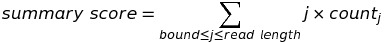

# Outlier (anomaly) detection

The choice of which methods should be used with superSTR output is context-dependent. We have implemented an outlier detection method that uses the upper bound of the 95% confidence interval on an estimate of the 95th quantile of a background dataset. Alternative strategies that allow explicit specification of expected outlier fraction in your data beyond setting a quantile value may be useful, and should be quick to implement - details are in the [Extensions](#extensions) section.

## Time and resource requirements

Anomaly detection methods may be highly resource-intensive, or produce outputs for very large numbers of motifs. To help with managing this load we provide a set of (optional) flags that allow you to limit the outlier detection process to certain motifs by identity or length. 

They are:

`--pathogenic`

Limits outlier detection to known-pathogenic motifs sourced from Bahlo, M. *et al*, [Recent advances in the detection of repeat expansions with short-read next-generation sequencing](https://f1000research.com/articles/7-736/v1), F1000 Research (2018).

`--max_motif n`

Limits outlier detection to motifs with a motif length <= n.

## Metrics

**Max-length count**

This is simply the (library-size normalised) count of reads which have a repetition running the full length of the read, or the proportion of reads which are 'pure' repeat in the experiment.

**superSTR summary score**

This score is generated by:

The lower and upper bounds for calculation can be set by the `--min_len` and `--max_len` parameters and will default to 75% of the read length and the read length, respectively.

**Count vector**

Some methods may use the full superSTR library-size normalised read count vector.

## Anomaly detection methods

**ABC bootstrapped 95th quantile estimator**

This method estimates the 95% confidence interval for the metric's 95th (or other) quantile. It uses the ABC bootstrap (Diciccio T, Efron B, [More accurate confidence intervals in exponential families](http://citeseerx.ist.psu.edu/viewdoc/download?doi=10.1.1.998.7855&rep=rep1&type=pdf), 1992, Biometrika 79 231–245). The ABC bootstrap provides a more-conservative estimate of the 95th quantile than the standard bootstrap given the distributions of summary scores observed in superSTR analysis.

**ABC-bootstrapped 95th quantile estimator on the summary score for known-pathogenic motifs:** `python outliers.py -i input_dir/ --pathogenic --bootstrapCI -pc 95 -is`

**ABC-bootstrapped 95th quantile estimator on the pure-repeat count for known-pathogenic motifs:** `python outliers.py -i input_dir/ --pathogenic -ml --bootstrapCI -pc 95`

**ABC-bootstrapped 99th quantile estimator on the pure-repeat count for known-pathogenic motifs:** `python outliers.py -i input_dir/ --pathogenic -ml --bootstrapCI -pc 99`

# Extensions

Example implementations of alternative outlier detection methods will be uploaded shortly.
