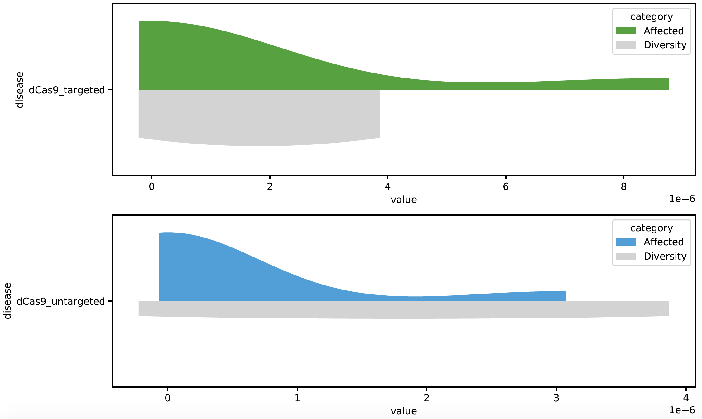

# Visualisation

This section of the document describes example visualisations for superSTR provided in the visualise.py script.

# Requirements

Similar to outlier detection, visualisation requires a number of python libraries; I again recommend using conda or venv. You should be able to use the same environment for both outlier detection and visualisation:

```
source activate superSTR
pip install numpy
pip install pandas
pip install matplotlib
pip install seaborn
```

# Visualisations

## Violin plots

In some analyses you may have a background STR distribution (for example, the controls in a case-control type analysis). One way of visualising superSTR metrics is to use split violin plots:



The example script in visualisation.py is able to generate these visualisations while making reasonable guesses as to color maps; you may need to modify the source code to achieve a particular visual style.
